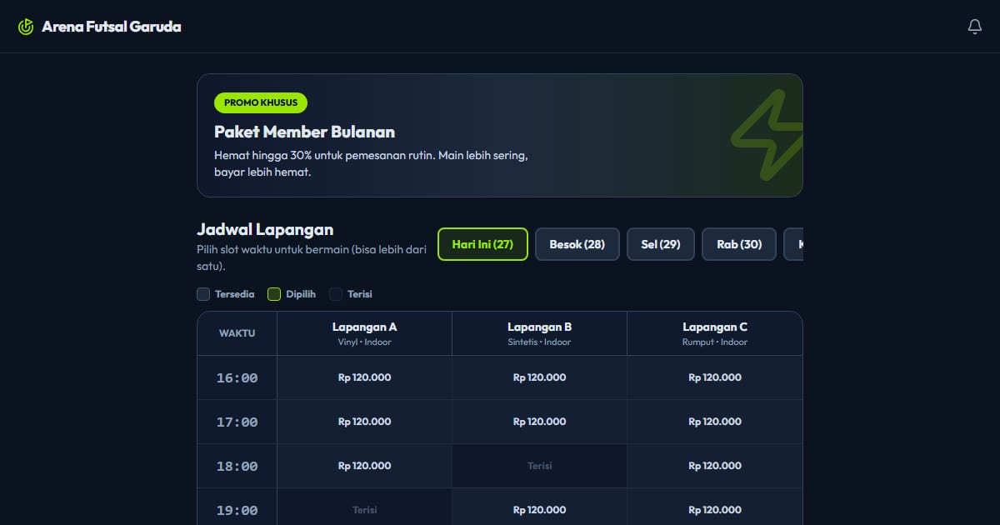

# Arena Futsal Garuda — Booking Lapangan Online

Booking lapangan futsal online lewat grid jadwal jam × lapangan. Pilih slot, konfirmasi, dan main tanpa ribet.

**Demo live:** https://reservasi-futsal.vercel.app



> Aplikasi reservasi contoh. Data tersimpan di browser (localStorage), tanpa backend.

## Konsep

Paradigma **grid waktu**: tabel jam × lapangan, pilih beberapa slot sekaligus, dan total harga diperbarui langsung.

## Halaman

`/`

## Teknologi

- Next.js 15.5 (App Router) dan React 19
- Tailwind CSS v4
- JavaScript
- Framer Motion, Lucide (ikon)
- Font: Outfit (next/font)
- SEO: metadata per halaman, Open Graph, JSON-LD, sitemap.xml, dan robots.txt

## Menjalankan secara lokal

```bash
npm install
npm run dev
```

Buka http://localhost:3000. Untuk build produksi: `npm run build` lalu `npm start`.

---

Bagian dari koleksi 5 aplikasi reservasi di [PortalReservasi](https://portal-reservasi-nu.vercel.app). Dibuat oleh [PintuWeb](https://pintuweb.com), jasa pembuatan website.
